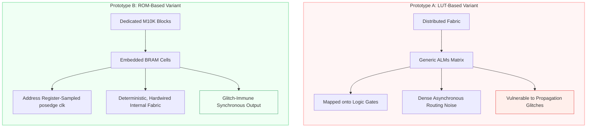

# Synchronous ROM-Based Stream Cipher: Hardware/Software Co-Design and Resource Optimization on Intel Cyclone V FPGAs

> **University Project | Hardware and Embedded Security Laboratory** > MSc in Cybersecurity | University of Pisa 
> 
> 
> A rigorous SystemVerilog implementation of a symmetric stream cipher core optimized for Intel Cyclone V FPGAs. The architecture features a non-linear cryptographic transform utilizing an AES S-Box mapped directly onto embedded synchronous M10K memory blocks. The repository showcases a complete digital design flow, containing an adaptive self-checking testbench framework driven by an algorithmic Python Golden Model alongside an in-depth hardware efficiency analysis comparing distributed logic (LUT) and block memory (ROM) configurations.
> 
> 

| Technical Parameter | Specification Details |
| --- | --- |
| **👤 Authors** | **Giovanni Del Bianco, Federico Pucci** |
| **💻 Hardware Description** | **SystemVerilog (IEEE 1800 Standard)** |
| **🛠️ Verification & Co-Design** | **Python 3 (Golden Model & Test Vector Generation)** |
| **⚙️ Synthesis & EDA Tools** | **Intel Quartus Prime Lite Edition v25.1, ModelSim** |
| **🎯 Silicon Target** | **Intel Cyclone V GX FPGA (5CGXFC9D6F27C7)** |
| **⏱️ Design Clock Target** | **100 MHz nominal frequency ($T_{clk} = 10\text{ ns}$)** |
| **🚀 Operational Performance** | **20 MB/s (160 Mbit/s) constant deterministic throughput** |
| **🧠 Key Optimization** | **Synchronous ROM block inference via embedded M10K cells** |
| **📊 Hardware Saving** | **-59% ALM utilization and -31% Register footprint vs. LUT variant** |


## 🚨 The Architectural Challenge: Silicon Efficiency vs. Combinational Glitches

### 1. The Core Cryptographic Bottleneck: S-Box Mapping

In lightweight stream cipher architectures, the primary computational bottleneck resides in the implementation of the non-linear substitution layer. This design integrates a standard 8-bit Advanced Encryption Standard (AES) Substitution Box (S-Box) as its core Lookup Table (LUT) to guarantee high confusion properties.

Mathematically, an 8-bit S-Box requires a static mapping of $256 \times 8\text{ bits}$, translating to a total storage requirement of exactly **2,048 bits** of cryptographic constants. When targeting physical silicon, an unoptimized implementation of such a high-density, non-linear lookup array can catastrophically degrade the chip's logical efficiency and compromise signal integrity.

### 2. Prototype A: The Pitfalls of the Combinational (LUT-Based) Approach

The initial exploratory prototype, `Stream_cipher_v1_LUT`, handles the S-Box mapping as a purely combinational function . This configuration leverages asynchronous logic blocks, describing the substitution matrix via extensive combinational `case` assignments that the Electronic Design Automation (EDA) tool forces onto the generic logic fabric of the FPGA.

While this approach yields an unclocked, immediate output propagation right after address evaluation, it introduces severe structural deficiencies under production workloads :

* 
**Area Saturation:** Quartus Prime is forced to synthesize the static 256-byte table using a massive, unstructured network of generic logic gates and multiplexers, consuming **61 Adaptive Logic Modules (ALMs)**. This represents a significant waste of the logical estate on assets that are inherently static.


* 
**Routing Congestion:** Mapping a highly irregular matrix like the AES S-Box across distributed logic cells generates a dense, unstructured interconnection network. As system complexity grows, this causes severe routing congestion during the *Place-and-Route* phase, lengthening wire paths and leading to unpredictable propagation delay skews.


* **Combinational Glitches:** Because the underlying data paths feature varying physical lengths and parasitic capacitances, intermediate logic gates do not switch simultaneously. This introduces high-frequency, parasitic switching noise—known as **combinational glitches**—onto the internal encryption buses. If these unstable signals leak or cascade into downstream mixing stages (such as the XOR unit), they can increase dynamic power consumption and compromise the deterministic safety lines of the hardware.


### 3. Prototype B: The Synchronous (ROM-Based) Solution

To completely eliminate combinational hazards and preserve general-purpose logic gates for other system modules, the final production architecture, `Stream_cipher_v1_ROM`, transitions to a fully synchronous approach . By wrapping the S-Box lookup within a sequential, clock-driven boundary, Intel Quartus Prime transparently infers the use of dedicated, hardware-backed silicon structures: the embedded **M10K block RAM cells**.



By isolating the 2,048-bit S-Box array inside a dedicated block memory, the hardware footprint drops to just **25 ALMs**. The introduction of a dedicated synchronous memory block forces the address to be sampled cleanly on the rising edge of the system clock, ensuring that the resulting keystream is entirely immune to combinational skews and completely predictable before it enters the final XOR transformation block.


## 🛡️ System Architecture & The Interlocked Handshake Protocol

### 1. Hierarchical Datapath Submodules
The hardware architecture is organized following a strict structural hierarchy inside the top-level entity `stream_cipher_top`. The design cleanly decouples the decision-making logic (Control Unit) from the data manipulation elements (Datapath) to simplify optimization during the synthesis phase.

<p align="center">
  
</p>

The system architecture integrates four specialized submodules connected through internal 1-bit and 8-bit signal buses :

* 
**`i_ctrl` (Control Unit):** Coordinates the execution flow of the system. It interprets incoming protocol indicators and drives internal data path control lines, handling the state machine transitions.


* 
**`i_counter` (Index Counter):** An 8-bit priority-driven sequential register . It handles asynchronous clearing (`rst_n`), parallel loading of the secret initial key material (`load_en`), and synchronous value increments (`count_en`) to generate the changing address space .


* 
**`i_sbox` (S-Box Memory):** Encapsulates the complete AES non-linear mapping constants. It operates as a fully synchronous, registered lookup structure that fetches a unique keystream segment during each cycle.


* 
**`i_xor` (XOR Unit):** A purely combinational processing block (`always_comb`). It instantly applies a bitwise eXclusive OR operation between the message stream and the retrieved keystream byte to execute encryption or decryption dynamically.


### 2. The Strict Interface Specifications

To operate correctly within a larger System-on-Chip (SoC) framework, the module exposes an explicit, type-safe interface boundary. Data transfer and control validation are strictly governed by a 4-phase interlocked handshake protocol.

The physical hardware ports are mapped according to the following specifications:

| Signal Name | Port Direction | Width (Bits) | Hardware/Protocol Function |
| --- | --- | --- | --- |
| `clk` | Input | 1 | Master system clock domain (active on rising edges).

 |
| `rst_n` | Input | 1 | Asynchronous active-low reset for immediate state clearing.

 |
| `new_msg` | Input | 1 | Key configuration flag; triggers parallel loading of the key `K`.

 |
| `in_valid` | Input | 1 | Control flag asserted by the host to mark valid input data.

 |
| `key_in` | Input | 8 | Secret 8-bit initialization key `K`.

 |
| `data_in` | Input | 8 | Raw plaintext or ciphertext byte to be processed.

 |
| `out_ready` | Output | 1 | Handshake flag asserted by the cipher when output is stable.

 |
| `data_out` | Output | 8 | Valid encrypted or decrypted output byte.

 |

---

### 3. Handshake Flow Control and Throughput Capping

The protocol guidelines dictate that an external master must hold the `in_valid` line high until the core asserts `out_ready`. Furthermore, the host is strictly required to de-assert `in_valid` once the output transaction is completed. This mutual locking mechanism prevents data duplication or dropped bytes if the master peripheral experiences transmission stalls.

<p align="center">
  
</p>

Because this handshake logic requires multiple phase transitions, it acts as the primary bottleneck for system execution times:

1. 
**Cycle 1 (`ST_IDLE`):** The system samples the input bus and detects that `in_valid == 1`, moving the core into the processing timeline.


2. 
**Cycle 2 (`ST_ROM_WAIT`):** A mandatory wait cycle introduced to absorb the internal registered clock latency of the physical M10K block RAM .


3. 
**Cycle 3 (`ST_READY`):** The keystream byte stabilizes. The core drives `out_ready = 1` and asserts `count_en` to increment the address counter .


4. 
**Cycle 4 (`ST_WAIT`):** Safety gate. The core blocks further calculation until the host responds by driving `in_valid = 0`, ensuring precise byte-by-byte tracking .


5. 
**Cycle 5 (`Return to Idle`):** The handshake finishes cleanly, allowing the internal control registers to reset for the next operation.


#### The Throughput Cap Proof

This 5-cycle transactional sequence is implemented identically within both the LUT and ROM architectures to maintain a unified system interface. At a baseline frequency of $f_{CLK} = 100\text{ MHz}$, the system period is defined as:

$$T_{CLK} = \frac{1}{100\text{ MHz}} = 10\text{ ns} \quad \text{\cite{581}}$$

The total structural latency ($L$) for a single transaction translates to:

$$L = L_{CC} \times T_{CLK} = 5 \times 10\text{ ns} = 50\text{ ns} \quad \text{\cite{594-595}}$$

Therefore, the maximum achievable system throughput under steady-state conditions is mathematically capped at:

$$\text{Throughput} = \frac{1\text{ Byte}}{50\text{ ns}} = 20\text{ MB/s} \quad (160\text{ Mbit/s}) \quad \text{\cite{611, 613, 615}}$$

This proof demonstrates that the combinational version (`Stream_cipher_v1_LUT`) cannot outperform the synchronous variant (`Stream_cipher_v1_ROM`) in data processing speed. Since the outer communication layer forces a fixed 5-cycle envelope, the immediate execution time of the LUT S-Box is effectively wasted while waiting for handshake transitions, validating the choice of a block-RAM structure.


## 🧠 Under the Hood: Dedicated Memory Inference & Performance Density

### 1. Technology Mapping and RAM Inference

The defining architectural breakthrough of `Stream_cipher_v1_ROM` is the conscious transition from distributed combinational logic gates to dedicated silicon sub-blocks. When synthesizing the S-Box table, specialized SystemVerilog sequential `case` constructs are structured inside a dedicated clock-driven block . This precise description allows the Intel Quartus Prime synthesis engine to bypass generic logic generation and instead trigger **automated RAM Inference**.

The static $256 \times 8\text{-bit}$ AES S-Box array is directly mapped onto the physical **M10K embedded memory blocks** native to the Cyclone V architecture.

* 
**The LUT Variant** distributes its lookup graph chaoticly across the chip, consuming **61 ALMs** and **19 registers**.


* 
**The ROM Variant** isolates the table data completely inside the internal hardwired memory cell lines, utilizing exactly **2,048 block memory bits**. This strategy scales down general-purpose logic consumption to just **25 ALMs** and **13 registers**—achieving a **59% reduction in logic area** and a **31% reduction in the register footprint**.


---

### 2. Quantifying Hardware Efficiency (Area Density)

To provide an objective, data-driven justification for the final architecture, a formal **Hardware Area Efficiency metric ($E$)** is defined. This metric measures the performance density of the circuit by evaluating how much operational throughput the core can squeeze out of every individual Adaptive Logic Module (ALM) utilized on the chip fabric :

$$E = \frac{\text{Throughput}}{\text{Area}} \quad \left[\frac{\text{MB/s}}{\text{ALM}}\right] \quad \text{\cite{1012-1014}}$$

Given the steady-state nominal throughput of $20\text{ MB/s}$ enforced by the outer handshake protocol interface layer for both implementations, the comparative mathematical evaluation yields:

* **Distributed Logic Implementation (LUT Model):**

$$E_{LUT} = \frac{20\text{ MB/s}}{61\text{ ALM}} \approx 0.328\text{ MB/s/ALM} \quad \text{\cite{1017-1020}}$$


* **Embedded Memory Implementation (ROM Model):**

$$E_{ROM} = \frac{20\text{ MB/s}}{25\text{ ALM}} = 0.800\text{ MB/s/ALM} \quad \text{\cite{1021-1024}}$$


The empirical density calculations prove that the ROM-based variant is **2.4 times more efficient** than the LUT model in terms of silicon area utilization. Because the M10K blocks are standalone hardware structures already baked into the physical FPGA layout, migrating the static lookup data into them represents a **virtually "zero cost" area optimization** . It frees up critical generic logic assets that can be reassigned to other intensive computational operations.

---

### 3. System-on-Chip (SoC) Scalability

From a production System-on-Chip (SoC) perspective, saving generic ALMs is a vital engineering priority. In realistic embedded infrastructures, the cryptographic cipher core does not live in isolation; it is tightly packed alongside main CPUs, DMAs, and high-speed communication interfaces.

By offloading static table weights into block RAM, the ROM core delivers a pristine design layout with shorter and highly predictable signal path lengths directly routed to the memory blocks . This structured placement eliminates the risk of logic routing congestion as system density expands, ensuring excellent scalability and stable, highly repeatable synthesis outcomes across iterative design compilations.


## 🧠 Under the Hood: Dedicated Memory Inference & Performance Density

### 1. Technology Mapping and RAM Inference

The defining architectural breakthrough of `Stream_cipher_v1_ROM` is the conscious transition from distributed combinational logic gates to dedicated silicon sub-blocks. When synthesizing the S-Box table, specialized SystemVerilog sequential `case` constructs are structured inside a dedicated clock-driven block . This precise description allows the Intel Quartus Prime synthesis engine to bypass generic logic generation and instead trigger **automated RAM Inference**.

The static $256 \times 8\text{-bit}$ AES S-Box array is directly mapped onto the physical **M10K embedded memory blocks** native to the Cyclone V architecture.

* 
**The LUT Variant** distributes its lookup graph chaoticly across the chip, consuming **61 ALMs** and **19 registers**.


* 
**The ROM Variant** isolates the table data completely inside the internal hardwired memory cell lines, utilizing exactly **2,048 block memory bits**. This strategy scales down general-purpose logic consumption to just **25 ALMs** and **13 registers**—achieving a **59% reduction in logic area** and a **31% reduction in the register footprint**.


---

### 2. Quantifying Hardware Efficiency (Area Density)

To provide an objective, data-driven justification for the final architecture, a formal **Hardware Area Efficiency metric ($E$)** is defined. This metric measures the performance density of the circuit by evaluating how much operational throughput the core can squeeze out of every individual Adaptive Logic Module (ALM) utilized on the chip fabric :

$$E = \frac{\text{Throughput}}{\text{Area}} \quad \left[\frac{\text{MB/s}}{\text{ALM}}\right] \quad \text{\cite{1012-1014}}$$

Given the steady-state nominal throughput of $20\text{ MB/s}$ enforced by the outer handshake protocol interface layer for both implementations, the comparative mathematical evaluation yields:

* **Distributed Logic Implementation (LUT Model):**

$$E_{LUT} = \frac{20\text{ MB/s}}{61\text{ ALM}} \approx 0.328\text{ MB/s/ALM} \quad \text{\cite{1017-1020}}$$


* **Embedded Memory Implementation (ROM Model):**

$$E_{ROM} = \frac{20\text{ MB/s}}{25\text{ ALM}} = 0.800\text{ MB/s/ALM} \quad \text{\cite{1021-1024}}$$


The empirical density calculations prove that the ROM-based variant is **2.4 times more efficient** than the LUT model in terms of silicon area utilization. Because the M10K blocks are standalone hardware structures already baked into the physical FPGA layout, migrating the static lookup data into them represents a **virtually "zero cost" area optimization** . It frees up critical generic logic assets that can be reassigned to other intensive computational operations.

---

### 3. System-on-Chip (SoC) Scalability

From a production System-on-Chip (SoC) perspective, saving generic ALMs is a vital engineering priority. In realistic embedded infrastructures, the cryptographic cipher core does not live in isolation; it is tightly packed alongside main CPUs, DMAs, and high-speed communication interfaces.

By offloading static table weights into block RAM, the ROM core delivers a pristine design layout with shorter and highly predictable signal path lengths directly routed to the memory blocks . This structured placement eliminates the risk of logic routing congestion as system density expands, ensuring excellent scalability and stable, highly repeatable synthesis outcomes across iterative design compilations.


## 💻 Automated Co-Verification Framework (Python Golden Model)

### 1. Behavioral Co-Design & Vector Serialization

To guarantee that the SystemVerilog RTL description complies with the mathematical specifications of the stream cipher, the verification architecture relies on a cross-platform **Hardware/Software Co-Verification framework** . The bridge between the algorithmic description and the physical layout is established by a software reference model written in Python, named `GoldenModel.py`.

The verification flow acts as a decoupled pipeline :

* 
**Algorithmic Computation:** The Python script models the precise sequential data progression of the hardware. It processes text strings or raw hexadecimal arrays and handles the circular S-Box memory index manipulation using the modulo operation.


* 
**Stimulus Serialization:** Upon calculating the exact cryptographic transformations, the script automatically generates formatted external test vector files with the `.tv` extension (`_input.tv` for hardware stimuli and `_expected.tv` for the definitive Golden Reference) .

```mermaid
graph LR
    %% Data Generation Domain (Software)
    subgraph SW [Software Environment]
        user([User Input]) -- "Message / Key" --> python[GoldenModel.py]
    end

    %% Test Vector Storage Artifacts
    subgraph Storage [Workspace Storage]
        file_in[modelsim/tv/Hello_input.tv]
        file_exp[modelsim/tv/Hello_expected.tv]
    end

    %% Simulation & Verification Domain (Hardware RTL)
    subgraph HW [Hardware Verification Domain]
        modelsim[ModelSim Core<br>RTL Design]
        verify{Bit-by-Bit<br>Verification}
    end

    %% Autonomous Data Pipeline Links
    python -- "Generates .tv<br>Artifacts" --> Storage
    
    file_in -- "Loads Stimuli" --> modelsim
    file_exp -- "Loads Expected<br>Vectors" --> modelsim
    
    modelsim --> verify
    verify -- Match --> success([SUCCESS])
    verify -- Mismatch --> failed([FAILED])

    %% Custom Industrial Professional Palette
    style user fill:#f7fafc,stroke:#4a5568,stroke-width:2px;
    style python fill:#fff5f5,stroke:#e53e3e,stroke-width:2px;
    style file_in fill:#ebf8ff,stroke:#3182ce,stroke-width:1px;
    style file_exp fill:#ebf8ff,stroke:#3182ce,stroke-width:1px;
    style modelsim fill:#f0fff4,stroke:#38a169,stroke-width:2px;
    style verify fill:#fff3cd,stroke:#dd6b20,stroke-width:1px;
    style success fill:#f0fff4,stroke:#38a169,stroke-width:2px;
    style failed fill:#fff5f5,stroke:#e53e3e,stroke-width:2px;
    style SW fill:#fdf2f8,stroke:#db2777,stroke-width:1px,stroke-dasharray: 3 3;
    style Storage fill:#fffaf0,stroke:#dd6b20,stroke-width:1px,stroke-dasharray: 3 3;
    style HW fill:#f0fdf4,stroke:#16a34a,stroke-width:1px,stroke-dasharray: 3 3;
```




These serialized byte arrays are centered inside the `modelsim/tv/` workspace directory, isolating the generation domain from the active simulation engine.


### 2. Advanced Self-Checking Testbench Architecture

The primary verification engine is encapsulated within an automated, file-driven testbench environment (`tb_stream_cipher.sv`) operating on a Black-Box Testing paradigm. The simulation logic reads the synchronized file descriptors dynamically using the SystemVerilog `$fscanf` task, mapping the hexadecimal entries into local memory storage structures at runtime .

The simulation block loops continuously until it hits the End-Of-File sentinel (`$feof`), passing the parsed bytes down to a modular execution task called `send_and_check`.

```systemverilog
// Automated response capturing inside the send_and_check task
task send_and_check(input logic [7:0] bin, input logic [7:0] bexp);
    @(posedge clk);
    in_valid = 1;
    data_in = bin;
    
    // Adaptive synchronization gate
    wait (out_ready == 1);
    
    // Immediate sampling checking block
    if (data_out !== bexp) begin
        $display("[FAILED] t=%t | In:%h | Out:%h | Expected:%h", $time, bin, data_out, bexp);
        $finish;
    end else begin
        $display("[OK] t=%t | In:%h -> Out:%h", $time, bin, data_out);
    end
    
    @(posedge clk);
    in_valid = 0;
endtask

```

#### The Vulnerability Interception Strategy

The checking module utilizes the case inequality operator (`!==`) instead of the standard logical inequality operator (`!=`). This design pattern provides a significant hardening advantage during verification:

* The standard `!=` operator evaluates to an ambiguous condition if any bit on the physical `data_out` bus floats into an uninitialized or floating state.
* The strict case inequality operator (`!==`) performs an exact bit-by-bit match, explicitly capturing forbidden **high-impedance (Z)** or **undefined (X)** states . If a logic gate failure causes a bus to float, the testbench immediately flags a critical diagnostic failure and chokes the simulation loop.


---

### 3. Stress Testing and Corner Case Resiliency

To validate the structural safety lines of the Control Unit, the design was subjected to aggressive edge-case testing through independent test frameworks:

#### A) User Stall Management (Handshake Stalling)

The verification suite `tb_stream_cipher_Slow.sv` simulates an unresponsive external master by intentionally keeping the `in_valid` flag locked at logic high for multiple consecutive clock cycles after an output is ready .

* 
**The Hardening Check:** The FSM handles the stall by freezing progression inside the `ST_WAIT` state .


* 
**The Outcome:** The internal counter halts its count progression, and the output bus remains stable, preventing "double-counting" and verifying full immunity against slow external host interfaces .


#### B) Out-of-Phase Asynchronous Reset

The framework `tb_stream_cipher_Reset.sv` stress-tests system recovery by injecting an asynchronous drop on the `rst_n` wire precisely **3 ns** after a rising clock edge, right in the middle of active ROM address compilation .

* 
**The Hardening Check:** The core intercepts the falling edge of the reset signal instantaneously without waiting for the subsequent clock boundary.


* 
**The Outcome:** The FSM breaks execution immediately, clears the data path busses, and retreats safely to the `ST_IDLE` state within a fraction of a clock cycle, certifying deterministic emergency recovery lines.


## 📂 Repository Tree

The production workspace is strictly structured to maintain a clean separation between documentation, high-level behavioral models, hardware implementation environments, and verification suites:

```text
.
├── .gitignore               # Multi-tool exclusion matrix (Quartus, ModelSim, PyCache)
├── LICENSE                  # MIT open-source license agreement
├── README.md                # Comprehensive technical documentation and case study
├── doc/                     # Academic and administrative verification reports
│   └── Relazione_HES_DelBianco.pdf.pdf   # Complete architectural report
├── model/                   # High-level software verification environment
│   └── GoldenModel.py       # Algorithmic Python model & test vector generator
├── modelsim/                # Functional simulation workspace
│   ├── tv/                  # Target storage for generated verification files (.tv)
│   ├── wave/                # Pre-configured waveform layouts (.do / .wave)
│   ├── build.py             # Automation script for ModelSim compilation
│   └── clean.py             # Script to purge local compilation artifacts and logs
├── quartus/                 # Hardware synthesis workspace
│   ├── constr/              # Physical constraints folder (contains stream_cipher.sdc)
│   ├── build.py             # Automated synthesis and execution wrapper script
│   ├── clean.py             # Tool to strip away temporary synthesis database structures
│   └── quartus.build        # Internal log configuration mapping
├── assets/                  
│   ├── FSM_finale.png
│   └── RTL_finale.png
└── tb/                      # Comprehensive verification suite directory
    ├── tb_stream_cipher.sv       # Main self-checking file-based testbench
    ├── tb_stream_cipher_Reset.sv # Out-of-phase asynchronous reset testbench
    └── tb_stream_cipher_Slow.sv  # Delayed handshake stall-testing testbench

```


## 🧼 Engineering Takeaways & Lessons Learned

Developing this cryptographic core provided key insights into the practical realities of digital systems engineering and hardware/software co-design:

* **The System-Level Performance Illusion:** This project highlighted the critical distinction between the performance of an isolated component and the throughput of a complete system. Although a combinational S-Box (LUT approach) delivers an instantaneous algebraic lookup, its speed advantage is entirely negated once embedded within a standard communication interface. Because the interlocked handshake protocol requires a 5-cycle transactional lifecycle to ensure bus stability, the synchronous variant (ROM approach) achieves the exact same operational throughput while cutting logic consumption by more than half.
* V
**Designing for Silicon Realities:** Working through the *Timing Closure* phase emphasized that code abstraction must align with the physical traits of the target silicon node . Navigating the **Temperature Inversion** phenomenon at the 28 nm node demonstrated that the worst-case propagation delays do not always align with high temperatures. Understanding how a low-temperature drop alters threshold voltages ($V_{th}$) allowed for precise calibration of the Synopsys Design Constraints (`.sdc`) file, changing a negative margin into a reliable, positive slack of $+0.033\text{ ns}$ .


* **Defensive Verification Posture:** Implementing the automated co-verification framework reinforced the value of zero-trust hardware testing. Writing self-checking testbenches using strict case inequality operators (`!==`) rather than standard checks proved essential for identifying uninitialized signals before they could cause system failures . Furthermore, subjecting the control unit to out-of-phase asynchronous resets and deliberate handshake stalls verified that the state machine remains resilient against unexpected conditions or slower external peripherals .


## 📜 License

This repository is open-source software distributed under the terms of the **MIT License**. Feel free to use, adapt, and build upon this hardware architecture for research, academic evaluation, or embedded security modeling.
